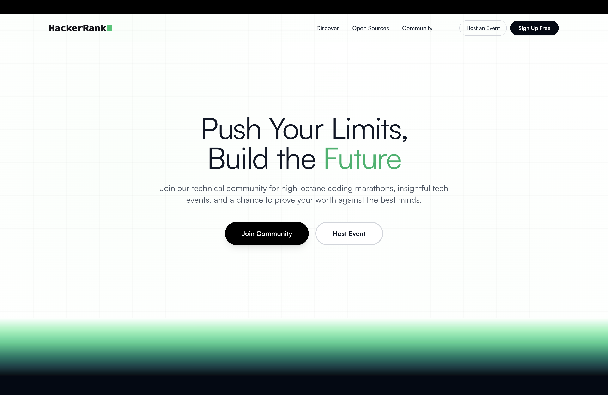
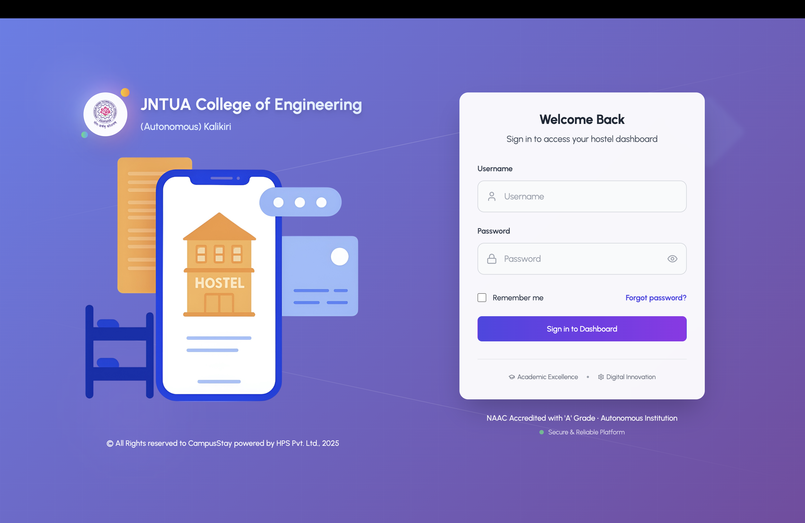
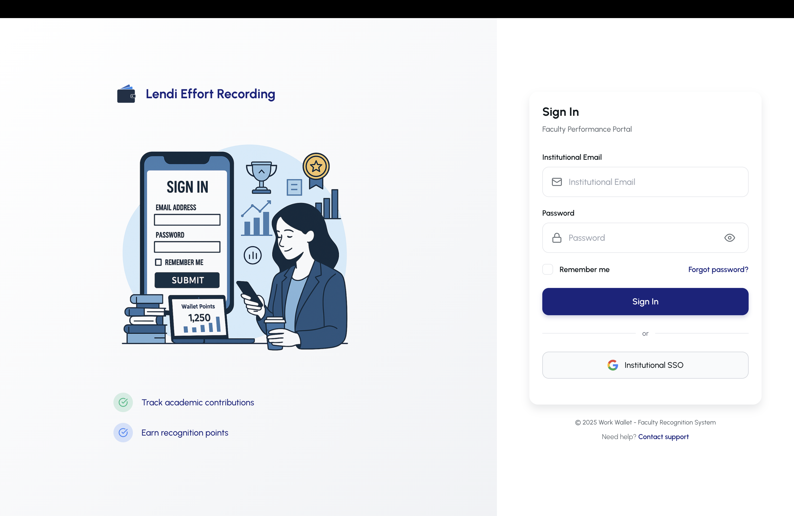
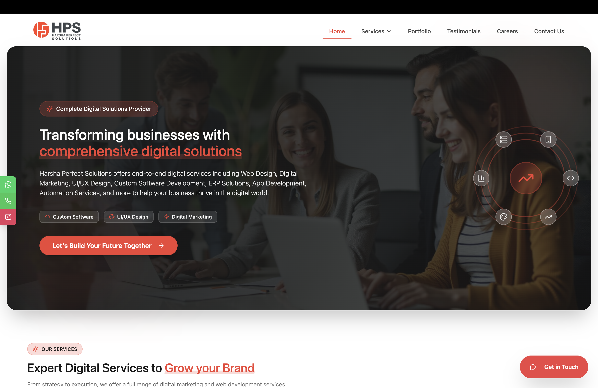

### Hi there 👋
I'm **Harshavardhan Vemali**

- Forward Deployed Engineer at **HPS Pvt Ltd** · 2+ years · 1,000+ daily users · 8+ enterprise deployments
- Built **HackSphere** — multi-tenant SaaS platform stress-tested with 200+ concurrent teams at a national hackathon
- Selected for **Google for Startups Cloud Program** & **Microsoft for Startups Founders Hub** · 2025
- HackerRank Campus Crew Ambassador — organised **GenzPulse** hackathon · 370 participants
- Final year B.Tech CSE @ **MVGR College of Engineering** · CGPA 8.68 / 10
- Open to full-time roles in **Backend · Full-Stack · AI/LLM Engineering**

### Tech Stack

  
  
  
  
    

  
  &nbsp;
  
  &nbsp;
  

### Live Systems I've Shipped

  
    

  
  

### Achievements

  
  &nbsp;
  

